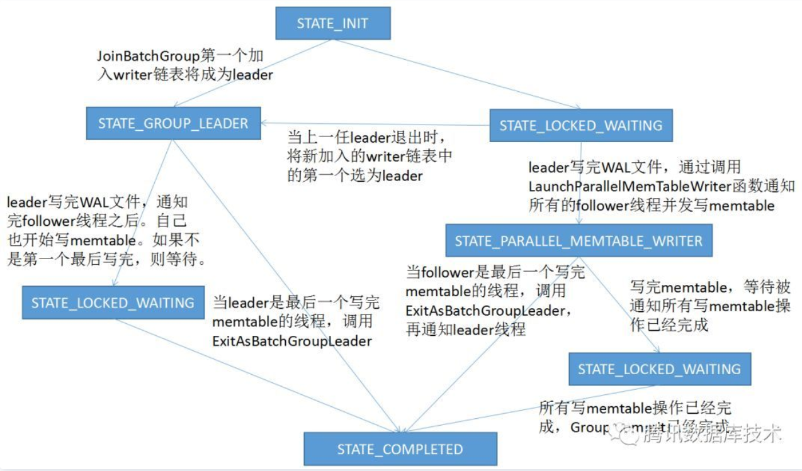

#### Write函数

#### 写入预处理

`Preprocesswrite`函数位于`db/db_impl/db_impl_write.cc`第894行。

在写入的时候会预先考虑几种情况：

- 如果WAL LOG满了，即大小超过了`rocksdb_max_total_wal_size`，则需要去切换LOG，从所有的CF中找出含有最老日志CF进行Flush, 以释放WAL日志空间。

- 如果写入Buffer满了，全局的`write buffer`超过了`rocksdb_db_write_buffer_size`时，会从所有的CF中找出最先创建的Memtable进行切换。

- 如果`trim_history_scheduler_`非空，

  > - 与FlushScheduler相似，TrimHistoryScheduler是一个FIFO队列，用于跟踪那些已经Flush的需要删除（又名被Trimmed）的Imm Table的CF。 实际的Trim可能会稍有延迟。 由于使用了互斥锁和原子变量，因此可以同时调用ScheduleWork，TakeNextColumnFamily和Empty。

- 如果`flush_scheduler_`非空，即如果某些CF中的Memtable已经满了并且需要Flush了，则会去调用`ScheduleFlushes`方法，将需要Flush的CF的Memtable切换一个新的，同时将原来的Memtable加入CFD的imm中，如果这个CFD的imm数量大于min_write_buffer_number_to_merge，并启动一个新的线程调用BGWorkFlush

  > - FlushScheduler keeps track of all column families whose memtable may be full and require flushing. Unless otherwise noted, all methods on FlushScheduler should be called only with the DB mutex held or from a single-threaded recovery context.

- 如果达到了触发写或者停止写的条件，

#### RocksDB写入流程

- 简要来说是：将解析后的记录（KTypeValue/KTypeDeletion）写入到WriteBatch中，将WAL写入到日志文件LOG中，将WriteBatch中的内容写入到Memtable中。
- 最初的写入流程，继承自 leveldb，多个写线程组成一个 group， leader 负责 group 的 WAL 及memtable 的提交，提交完后唤醒所有的 follwer，向上层返回。
- 支持 allow_concurrent_memtable_write 选项，在1的基础上，leader 提交完 WAL 后，group 里所有线程并发写 memtable。原理如下图所示，这个改进在 sync=0的时候，有3倍写入性能提升，在 sync=1时，有2倍性能提升，参考[Concurrent inserts and the RocksDB memtable](http://smalldatum.blogspot.com/2016/02/concurrent-inserts-and-rocksdb-memtable.html)
- 支持 enable_pipelined_write 选项，在2的基础上，引入流水线，第一个 group 的 WAL 提交后，在执行 memtable 写入时，下一个 group 同时开启，已到达 Pipeline 写入的效果。
- 每个WriteBatch代表一个事务，可以包含多条操作，可以通过调用WriteBatch::Put/Delete等操作将对应多条的key/value记录加入WriteBatch中。

##### 参考资料

- 详解RocksDB如何通过组提交提升性能：https://cloud.tencent.com/developer/article/1143439
- RocksDB 写入流程详解：https://developer.aliyun.com/article/409102
- RocksDB原理学习笔记：https://www.jianshu.com/p/0fc4b62f8ee5

在内存中进行compaction

对imm 进行合并 驻留在内存

根据workload建立新的索引结构