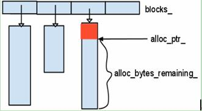

# RocksDB Arena

### Allocator

- Allocate：分配bytes字节的空间
- AllocateAligned：分配bytes字节的空间，并且进行内存对齐

```cpp
class Allocator {
 public:
  virtual ~Allocator() {}

  virtual char* Allocate(size_t bytes) = 0;
  virtual char* AllocateAligned(size_t bytes, size_t huge_page_size = 0,
                                Logger* logger = nullptr) = 0;

  virtual size_t BlockSize() const = 0;
};
```

### Arena

##### 在创建Arena对象时会计算最佳的BlockSize

```cpp
size_t OptimizeBlockSize(size_t block_size) {
  // Make sure block_size is in optimal range
  block_size = std::max(Arena::kMinBlockSize, block_size);
  block_size = std::min(Arena::kMaxBlockSize, block_size);

  // make sure block_size is the multiple of kAlignUnit
  if (block_size % kAlignUnit != 0) {
    block_size = (1 + block_size / kAlignUnit) * kAlignUnit;
  }

  return block_size;
}
```

##### Arena部分属性

- `kBlockSize`指定了每个Block的大小
- `blocks_`存储所有分配的块的指针
- `blocks_memory_`：当前申请的Blocks的总空间
- `alloc_bytes_remaining_`：申请了但是还没使用的空间大小
- `irregular_block_num`：不规则Block的个数。当申请的空间较大时，会产生不规则Block，该Block的大小为申请的空间大小。

```cpp
class Arena : public Allocator {
 private:
  char inline_block_[kInlineSize] __attribute__((__aligned__(alignof(max_align_t))));
  const size_t kBlockSize;
  typedef std::vector<char*> Blocks;
  Blocks blocks_;

  struct MmapInfo {
    void* addr_;
    size_t length_;

    MmapInfo(void* addr, size_t length) : addr_(addr), length_(length) {}
  };
  std::vector<MmapInfo> huge_blocks_;
  size_t irregular_block_num = 0;
  char* unaligned_alloc_ptr_ = nullptr;
  char* aligned_alloc_ptr_ = nullptr;
  size_t alloc_bytes_remaining_ = 0;

#ifdef MAP_HUGETLB
  size_t hugetlb_size_ = 0;
#endif  // MAP_HUGETLB
  char* AllocateFromHugePage(size_t bytes);
  char* AllocateFallback(size_t bytes, bool aligned);
  char* AllocateNewBlock(size_t block_bytes);

  size_t blocks_memory_ = 0;
  AllocTracker* tracker_;
};
```

##### 简易内存池

申请内存时，将申请到的内存块放入`blocks_`中，在Arena的生命周期结束后，统一释放掉所有申请到的内存。

```cpp
char* Arena::AllocateNewBlock(size_t block_bytes) {
  char* block = new char[block_bytes];
  size_t allocated_size;

  allocated_size = block_bytes;

  blocks_memory_ += allocated_size;
  
  blocks_.back() = block;
  return block;
}
```



