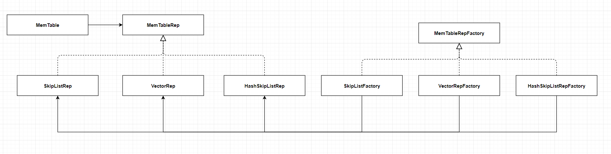

# RocksDB MemTable

### MemTable & MemTableList & MemTableListVersion


### MemTableRep

MemTableRep是使用不同数据结构的MemTable实现的基类，RocksDB在MemTableRep的基础上实现SkipListRep、HashSkipListRep、VectorRep，即为MemTable提供了跳跃表、哈希跳跃表和向量的数据结构实现。其使用了工厂方法模式，类之间的关系图如下：



各个具体的Factory通过实现CreateMemTableRep方法来生成具体的Rep对象，可以通过传入不同的键比较器或者其他的参数来生成不同的Rep对象。生成的Rep对象将会被传入到MemTable中，作为MemTable的数据结构：

```cpp
// MemTable中维护了一个插入Rep和范围删除Rep
class MemTable {
    private:
    std::unique_ptr<MemTableRep> table_;
  	std::unique_ptr<MemTableRep> range_del_table_;
}
```

MemTableRep的定义如下：

```cpp
class MemTableRep {
    public:
    class KeyComparator {
        public:
        typedef ROCKSDB_NAMESPACE::Slice DecodedType;
        virtual DecodedType decode_key(const char* key) const {
            return GetLengthPrefixedSlice(key);
        }
        virtual int operator()(const char* prefix_len_key1,
                               const char* prefix_len_key2) const = 0;
        virtual int operator()(const char* prefix_len_key,
                               const Slice& key) const = 0;
        virtual ~KeyComparator() {}
    };
    explicit MemTableRep(Allocator* allocator) : allocator_(allocator) {}
    virtual KeyHandle Allocate(const size_t len, char** buf);
    virtual void Insert(KeyHandle handle) = 0;
    virtual bool InsertKey(KeyHandle handle) {
        Insert(handle);
        return true;
    }
    virtual void InsertWithHint(KeyHandle handle, void** /*hint*/) {
        Insert(handle);
    }
    virtual bool InsertKeyWithHint(KeyHandle handle, void** hint) {
        InsertWithHint(handle, hint);
        return true;
    }
    virtual void InsertWithHintConcurrently(KeyHandle handle, void** /*hint*/) {
        // Ignore the hint by default.
        InsertConcurrently(handle);
    }
    virtual bool InsertKeyWithHintConcurrently(KeyHandle handle, void** hint) {
        InsertWithHintConcurrently(handle, hint);
        return true;
    }
    virtual void InsertConcurrently(KeyHandle handle);
    virtual bool InsertKeyConcurrently(KeyHandle handle) {
        InsertConcurrently(handle);
        return true;
    }
    virtual bool Contains(const char* key) const = 0;
    virtual void MarkReadOnly() {}
    virtual void MarkFlushed() {}
    virtual void Get(const LookupKey& k, void* callback_args,
                     bool (*callback_func)(void* arg, const char* entry));
    virtual uint64_t ApproximateNumEntries(const Slice& /*start_ikey*/,
                                           const Slice& /*end_key*/) {
        return 0;
    }
    virtual size_t ApproximateMemoryUsage() = 0;
    virtual ~MemTableRep() {}
    class Iterator {
        public:
        virtual ~Iterator() {}
        virtual bool Valid() const = 0;
        virtual const char* key() const = 0;
        virtual void Next() = 0;
        virtual void Prev() = 0;
        virtual void Seek(const Slice& internal_key, const char* memtable_key) = 0;
        virtual void SeekForPrev(const Slice& internal_key,
                                 const char* memtable_key) = 0;
        virtual void SeekToFirst() = 0;
        virtual void SeekToLast() = 0;
    };
    virtual Iterator* GetIterator(Arena* arena = nullptr) = 0;
    virtual Iterator* GetDynamicPrefixIterator(Arena* arena = nullptr) {
        return GetIterator(arena);
    }
    virtual bool IsMergeOperatorSupported() const { return true; }
    virtual bool IsSnapshotSupported() const { return true; }

    protected:
    virtual Slice UserKey(const char* key) const;
    Allocator* allocator_;
};
```

### SkipListRep & InlineSkipList

SkipListRep持有了一个InlineSkipList对象，通过调用InlineSkipList中的方法来实现MemTable的操作：

```cpp
class SkipListRep : public MemTableRep {
    InlineSkipList<const MemTableRep::KeyComparator&> skip_list_;
}
```


#### InlineSkipList::Node

**柔性数组：**在Node中将Key和链表每层的指针连续存储，相比于Key存指针的优势在于：减少部分内存的使用，并且可以更好地利用Cache的局部性。

`next_[i]`表示指向第`i`层后面一个Node的指针，`next_[1]`及之后的内存空间用于存储Key。跳跃表中层次`level`的范围为`[0, maxHeight-1]`。


```cpp
struct InlineSkipList<Comparator>::Node {
    private:
    std::atomic<Node*> next_[1];
};
```

Node对象在被分配空间时就会计算高度，并写入到`next_[0]`的前4个字节中：

- `prefix`表示存储存储`next[-(height-1),-1]`的指针所需要的字节数。在这里`next[0]`是`Node`对象自带的，我们不需要为它申请空间。刚开始`next[0]`存储的是该Node的高度，不过`next[0]`之后会用作跳跃表最底层的Node的指针。（画个图很好理解）

- `raw`表示总共申请到的空间，我们需要为`prefix`、`Node`和`key`分别分配对应的空间。
- `raw`向后移动`prefix`个字节后指向的就是`Node`对象，然后把该Node的高度存入即可。

```cpp
template <class Comparator>
typename InlineSkipList<Comparator>::Node*
InlineSkipList<Comparator>::AllocateNode(size_t key_size, int height) {
  auto prefix = sizeof(std::atomic<Node*>) * (height - 1);

  char* raw = allocator_->AllocateAligned(prefix + sizeof(Node) + key_size);
  Node* x = reinterpret_cast<Node*>(raw + prefix);

  x->StashHeight(height);
  return x;
}
```

.PNG)Node中一些方法：

```cpp
// 返回该节点第n层指向的Node节点(n>=0)
Node* Next(int n) {
    assert(n >= 0);
    return ((&next_[0] - n)->load(std::memory_order_acquire));
}

// 将该节点第n层指向的node节点设为x
void SetNext(int n, Node* x) {
    assert(n >= 0);
    (&next_[0] - n)->store(x, std::memory_order_release);
}

// 将该节点放置在prev节点的第level层之后
// 本质是一个链表插入操作
void InsertAfter(Node* prev, int level) {
    // 记 nn = prev->NoBarrier_Next(level)，即prev原来指向的下一个节点
    // this_node->next = nn
    NoBarrier_SetNext(level, prev->NoBarrier_Next(level));
    // 即 prev->next=this_node in this level
    prev->SetNext(level, this);
}
```

#### InlineSkipList::Splice

**Splice对象主要保存着最近一次插入的节点快照：**在非并发写入的情况下，`prev_`和`next_`是一个由`Node*`构成的数组，它保存了上一次插入时每层`prev`和`next`的位置，并且一定满足`prev_[i+1].key <= prev_[i].key < next_[i].key <= next_[i+1]`（画个图就能理解），即低层的范围一定比高层小。

在插入时，会从低层到高层遍历 `Splice`，若发现某一层包围了 `key`，说明更高的层都一定包围了这个`Key`，因此从这层开始遍历即可。

```cpp
struct InlineSkipList<Comparator>::Splice {
    int height_ = 0;
    Node** prev_;
    Node** next_;
};
```

Allocator为Splice分配空间的函数和示意图如下：

```cpp
template <class Comparator>
typename InlineSkipList<Comparator>::Splice*
InlineSkipList<Comparator>::AllocateSplice() {
    // Question: 这里为什么是要申请kMaxHeight_ + 1个而不是kMaxHeight_个？
    size_t array_size = sizeof(Node*) * (kMaxHeight_ + 1);
    char* raw = allocator_->AllocateAligned(sizeof(Splice) + array_size * 2);
    Splice* splice = reinterpret_cast<Splice*>(raw);
    splice->height_ = 0;
    splice->prev_ = reinterpret_cast<Node**>(raw + sizeof(Splice));
    splice->next_ = reinterpret_cast<Node**>(raw + sizeof(Splice) + array_size);
    return splice;
}
```


#### InlineSkipList中一些常见的比较查找函数

```cpp
bool KeyIsAfterNode(const char* key, Node* n) const;
bool KeyIsAfterNode(const DecodedKey& key, Node* n) const;
Node* FindGreaterOrEqual(const char* key) const;
Node* FindLessThan(const char* key, Node** prev = nullptr) const;
Node* FindLessThan(const char* key, Node** prev, Node* root, int top_level,
                   int bottom_level) const;
Node* FindLast() const;
template<bool prefetch_before>
void FindSpliceForLevel(const DecodedKey& key, Node* before, Node* after, int level,
                        Node** out_prev, Node** out_next);
void RecomputeSpliceLevels(const DecodedKey& key, Splice* splice,
                           int recompute_level);
```

#### InlineSkipList随机高度生成

以 1 / kBranching 的概率生成提升高度（默认为1/4），其原理是随机生成一个随机数`rnd->next()`，当这个值小于等于`Random::kMaxNext + 1) / kBranching_`（即`kScaledInverseBranching_`）时，会提升高度，大于时不提升高度。按照均匀概率分布，其提升的概率就是 1 / kBranching 。

```cpp
int InlineSkipList<Comparator>::RandomHeight() {
    auto rnd = Random::GetTLSInstance();

    int height = 1;
    while (height < kMaxHeight_ && height < kMaxPossibleHeight &&
           rnd->Next() < kScaledInverseBranching_) {
        height++;
    }
    assert(height > 0);
    assert(height <= kMaxHeight_);
    assert(height <= kMaxPossibleHeight);
    return height;
}
```

#### InlineSkipList插入过程

参考链接：https://gocode.cc/project/13/article/184

```cpp
bool InlineSkipList<Comparator>::Insert(const char* key, Splice* splice,
                                        bool allow_partial_splice_fix) {
  Node* x = reinterpret_cast<Node*>(const_cast<char*>(key)) - 1;
  const DecodedKey key_decoded = compare_.decode_key(key);

  // 取出插入节点的高度
  int height = x->UnstashHeight();
  assert(height >= 1 && height <= kMaxHeight_);

  // 与跳跃表当前的高度max_height(注意max_height是跳跃表当前的高度，而kMaxHeight是跳跃表最大允许的高度：默认12)进行比较
  // 当发现插入的高度大于跳跃表当前的高度时，更新该高度
  // 因为此时可能有多个线程同时写入，所以需要进行判断更新是否成功写入，如果成功写入或者其它线程已经更新了高度那么就退出循环
  int max_height = max_height_.load(std::memory_order_relaxed);
  while (height > max_height) {
    if (max_height_.compare_exchange_weak(max_height, height)) {
      max_height = height;
      break;
    }
  }
  assert(max_height <= kMaxPossibleHeight);

  int recompute_height = 0;
  if (splice->height_ < max_height) {
    // 若Splice对象从来没有被使用过，或者跳跃表高度增大了，这时需要初始化跳跃表高度位置的splice标记
    // 将最大高度的splice的prev和next分别设置为无穷小的head_和无穷大的null
    // 并记录Splice的高度为当前跳跃表的高度
    splice->prev_[max_height] = head_;
    splice->next_[max_height] = nullptr;
    splice->height_ = max_height;
    recompute_height = max_height;
  } else {
    while (recompute_height < max_height) {
      if (splice->prev_[recompute_height]->Next(recompute_height) !=
          splice->next_[recompute_height]) {
        ++recompute_height;
      } else if (splice->prev_[recompute_height] != head_ &&
                 !KeyIsAfterNode(key_decoded,
                                 splice->prev_[recompute_height])) {
        if (allow_partial_splice_fix) {
          Node* bad = splice->prev_[recompute_height];
          while (splice->prev_[recompute_height] == bad) {
            ++recompute_height;
          }
        } else {
          recompute_height = max_height;
        }
      } else if (KeyIsAfterNode(key_decoded, splice->next_[recompute_height])) {
        if (allow_partial_splice_fix) {
          Node* bad = splice->next_[recompute_height];
          while (splice->next_[recompute_height] == bad) {
            ++recompute_height;
          }
        } else {
          recompute_height = max_height;
        }
      } else {
        break;
      }
    }
  }
  assert(recompute_height <= max_height);
  if (recompute_height > 0) {
    RecomputeSpliceLevels(key_decoded, splice, recompute_height);
  }

  bool splice_is_valid = true;
  if (UseCAS) {
    // ...
  } else {
    for (int i = 0; i < height; ++i) {
      if (i >= recompute_height &&
          splice->prev_[i]->Next(i) != splice->next_[i]) {
        FindSpliceForLevel<false>(key_decoded, splice->prev_[i], nullptr, i,
                                  &splice->prev_[i], &splice->next_[i]);
      }
      // Checking for duplicate keys on the level 0 is sufficient
      if (UNLIKELY(i == 0 && splice->next_[i] != nullptr &&
                   compare_(x->Key(), splice->next_[i]->Key()) >= 0)) {
        // duplicate key
        return false;
      }
      if (UNLIKELY(i == 0 && splice->prev_[i] != head_ &&
                   compare_(splice->prev_[i]->Key(), x->Key()) >= 0)) {
        // duplicate key
        return false;
      }
      assert(splice->next_[i] == nullptr ||
             compare_(x->Key(), splice->next_[i]->Key()) < 0);
      assert(splice->prev_[i] == head_ ||
             compare_(splice->prev_[i]->Key(), x->Key()) < 0);
      assert(splice->prev_[i]->Next(i) == splice->next_[i]);
      x->NoBarrier_SetNext(i, splice->next_[i]);
      splice->prev_[i]->SetNext(i, x);
    }
  }
  if (splice_is_valid) {
    for (int i = 0; i < height; ++i) {
      splice->prev_[i] = x;
    }
    assert(splice->prev_[splice->height_] == head_);
    assert(splice->next_[splice->height_] == nullptr);
    for (int i = 0; i < splice->height_; ++i) {
      assert(splice->next_[i] == nullptr ||
             compare_(key, splice->next_[i]->Key()) < 0);
      assert(splice->prev_[i] == head_ ||
             compare_(splice->prev_[i]->Key(), key) <= 0);
      assert(splice->prev_[i + 1] == splice->prev_[i] ||
             splice->prev_[i + 1] == head_ ||
             compare_(splice->prev_[i + 1]->Key(), splice->prev_[i]->Key()) <
             0);
      assert(splice->next_[i + 1] == splice->next_[i] ||
             splice->next_[i + 1] == nullptr ||
             compare_(splice->next_[i]->Key(), splice->next_[i + 1]->Key()) <
             0);
    }
  } else {
    splice->height_ = 0;
  }
  return true;
}
```

#### SkipList示意图


## 备注

在实现我们设置的新的数据结构时，创建一个新的Rep继承MemTableRep，然后实现里面的一些方法。再加一个标记为加入到ImmList中。

Rep可以使用B+树实现。在MemTable被转换成ImmTable时，使用一个后台线程，将它转换成或者合并进Rep中，再删除掉原来的ImmTable。

TODO：具体的使用方式参考IMM的设计