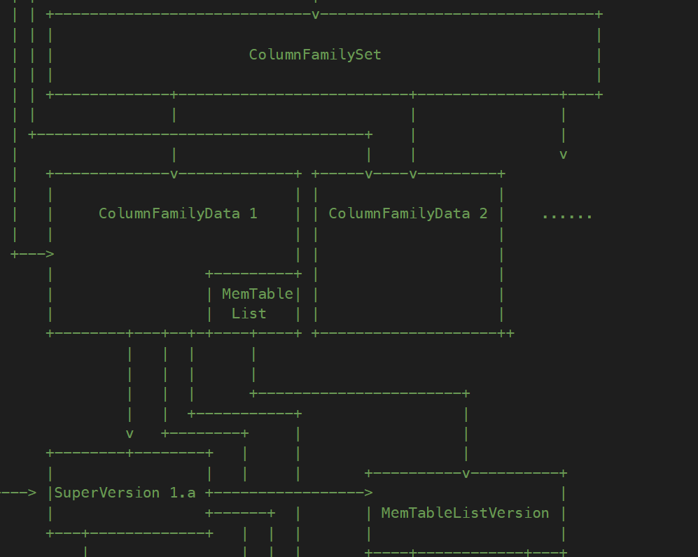

# RocksDB Version

#### VersionStorageInfo

VersionStorageInfo是Version的信息存储结构，每个Version的SST文件信息都存储在VersionStorageInfo中。、

> Note：学习的优先级较低，之后再补充

#### Version

Version是SST的一个完整的版本，SST的信息存储在VersionStorageInfo中，可以在这个版本上GET数据。

> Note：学习的优先级较低，之后再补充

#### SuperVersion

SuperVersion是DB的一个完整版本，它包含所有的信息：当前的MemTable、Imm MemTable和一个Version（包含SST的数据信息）的引用。访问SuperVersion中的成员不是线程安全的，需要额外加锁。


- `cfd`表示该SuperVersion所指向的CFD：CFD和SuperVersion是一对多的关系，一个CFD中可能会存在多个SuperVersion，因此一个SuperVersion可以唯一确定一个CFD。



- `mutable_cf_options`包含了一些可以更改的配置，比如`max_write_buffer_number`。
- `mem`指向了该CF中的MemTable，`imm`指向了该CF中的Imm MemTable的列表。在一个CF中只有一个MemTable，但允许存在多个Imm MemTable。
- `current`中存储了有关SST的信息。
- `to_delete`的作用主要体现在清理阶段的`CleanUp()`中，`imm->Unref()`会返回所有所有需要释放的MemTable并存储在这个数组中，然后会在析构时释放该数组中的MemTable。此过程不需要加锁。
- 调用`CleanUp()`和`init()`方法时需要加锁。

```cpp
struct SuperVersion {
    ColumnFamilyData* cfd;
    MemTable* mem;
    MemTableListVersion* imm;
    Version* current;
    MutableCFOptions mutable_cf_options;
    uint64_t version_number;
    WriteStallCondition write_stall_condition;
    InstrumentedMutex* db_mutex;
    SuperVersion() = default;
    ~SuperVersion();
    SuperVersion* Ref();
    bool Unref();
    void Cleanup();
    void Init(ColumnFamilyData* new_cfd, MemTable* new_mem,
              MemTableListVersion* new_imm, Version* new_current);
    static int dummy;
    static void* const kSVInUse;
    static void* const kSVObsolete;

    private:
    std::atomic<uint32_t> refs;
    autovector<MemTable*> to_delete;
};
```

#### VersionSet

VersionSet是整个DB的版本管理，它维护着MANIFEST文件。每个CF的版本单独管理。

> Note：学习的优先级较低，之后再补充